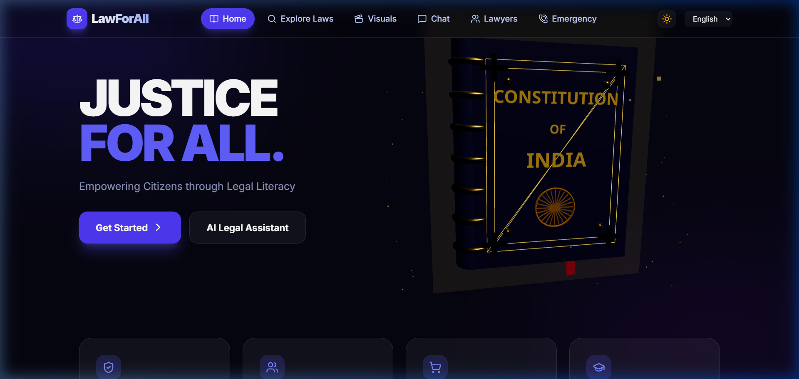
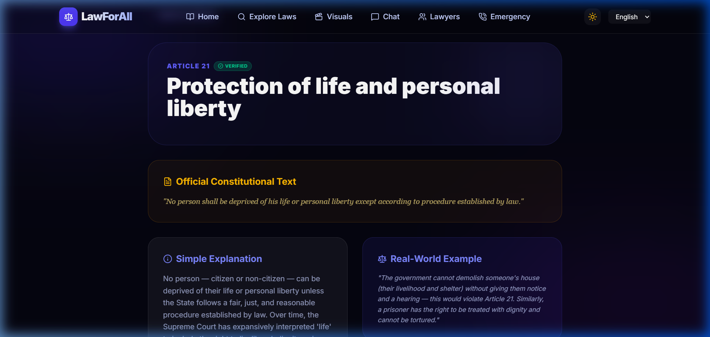
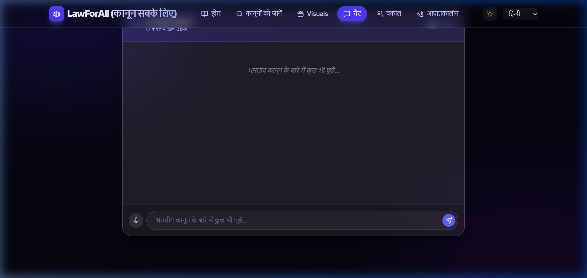

# LawForAll — AI Powered Legal Awareness Platform


## Description
LawForAll is a professional civic-tech application designed to empower citizens with legal knowledge. It provides a multilingual interface, an AI-powered legal assistant, and an interactive constitution explorer to make legal information more accessible to everyone.

### Key Features
- **Multilingual Support**: Available in English (EN), Hindi (HI), Kannada (KN), and Marathi (MR).
- **AI Legal Assistant**: Ask questions and get simplified legal explanations powered by Gemini AI.
- **Voice Support**: Full voice input and output capabilities for enhanced accessibility.
- **Constitution Explorer**: Explore verified data from the Constitution of India.
- **Advanced Search**: Quickly find articles and legal concepts.
- **Visual Learning**: Interactive components to help visualize legal proceedings.

## Screenshots
<div align="center">
  <h3>Homepage (English)</h3>
  
  
  <h3>Detailed Article View</h3>
  
  
  <h3>Multilingual Support & AI Chat (Hindi)</h3>
  
</div>

## Tech Stack
- **Frontend**: React + TypeScript
- **Styling**: TailwindCSS / CSS
- **Backend**: Node.js / Express
- **AI**: Gemini API
- **Accessibility**: Web Speech API

## Installation
To run the project locally, follow these steps:

1. Clone the repository:
   ```bash
   git clone https://github.com/<your-username>/lawforall.git
   cd lawforall
   ```
2. Install dependencies:
   ```bash
   npm install
   ```
3. Run the development server:
   ```bash
   npm run dev
   ```

## Environment Setup
Create a `.env` file in the root directory based on `.env.example`:
```env
GEMINI_API_KEY=your_api_key_here
```
> [!IMPORTANT]
> Never commit your real API keys to version control.

## Usage
Once the server is running, open your browser and navigate to:
[http://localhost:3000](http://localhost:3000)

## Disclaimer
"This app is for educational purposes only and does not constitute legal advice. Always consult with a qualified legal professional for actual legal matters."

## License
Distributed under the MIT License. See `LICENSE` for more information.
